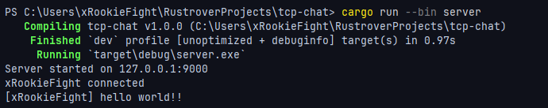

# tcp-chat
Lightweight TCP chat software written in rust.




---
> [!IMPORTANT]
> This software is on a beta version, bugs may occur. If you find an issue please report it from issues page.

---

## Features

* Lightweight TCP-based chat server & client
* Multiple clients support
* Configurable IP & port via `config.toml`
* Simple broadcast message system
* Cross-platform (Linux / Windows / macOS)
* Written in safe and modern Rust

---

## Getting Started

### Requirements

* Rust (stable)
* Cargo

---

### Installation

1. Clone the repository:

```bash
git clone https://github.com/xRookieFight/tcp-chat.git
cd tcp-chat
```

2. Edit the configuration file:

```toml
# config.toml
ip = "127.0.0.1"
port = 9000
```

3. Build the project:

```bash
cargo build --release
```

---

### Running the Server

```bash
cargo run --bin server
```

---

### Running the Client

```bash
cargo run --bin client
```

You can run **multiple clients** in different terminals to start chatting.

---

## License

This project is licensed under the MIT License.

---